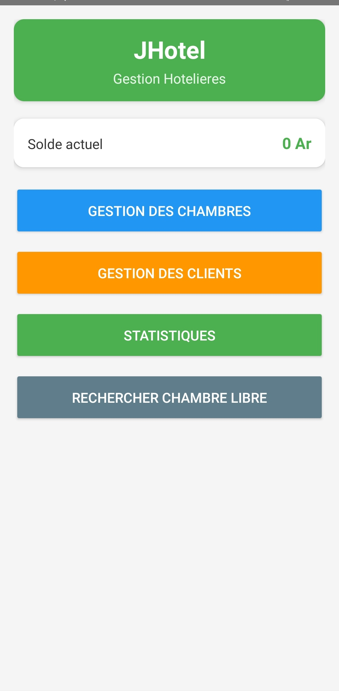
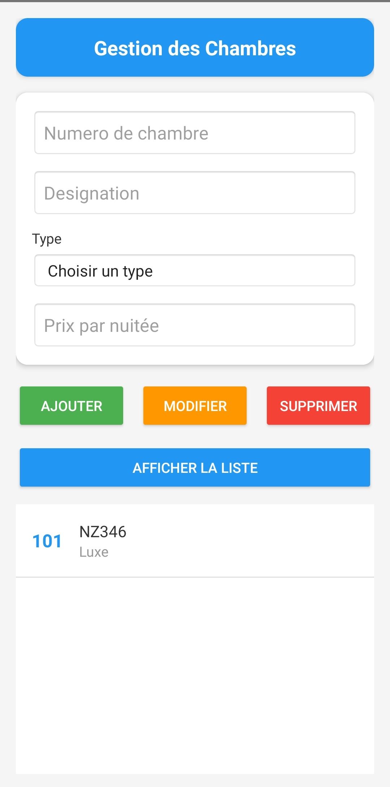
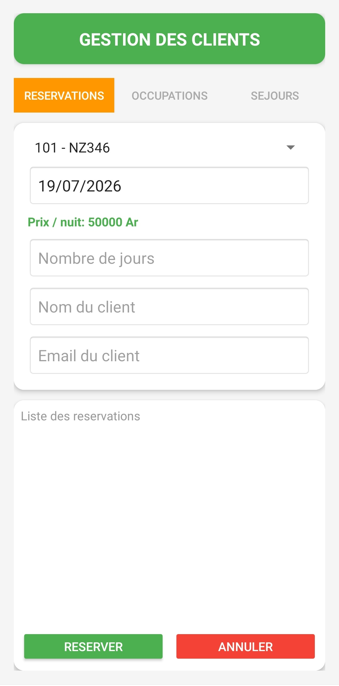
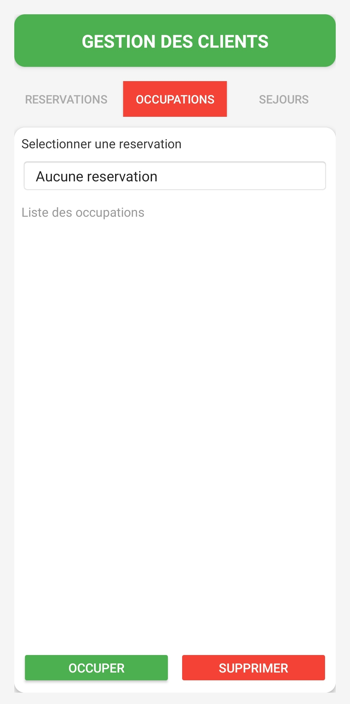
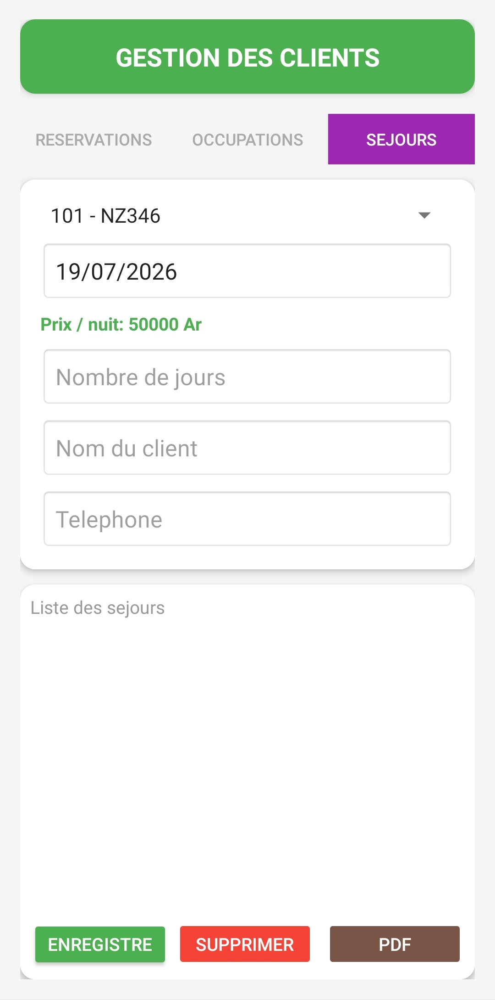

# 🏨 JHotel - Application de gestion hôtelière

Application Android de gestion hôtelière développée avec **Java** pour gérer facilement les chambres, réservations, séjours et occupations.

---

## 📱 Fonctionnalités

- 🏠 **Gestion des chambres** : Ajoutez, modifiez et supprimez des chambres
- 👤 **Gestion des clients** : Gérez les réservations, séjours et occupations
- 📅 **Réservations** : Créez et annulez des réservations avec envoi d'email
- 🛏️ **Séjours** : Enregistrez des séjours avec calcul automatique du prix
- 🔑 **Occupations** : Gérez l'occupation des chambres
- 📊 **Statistiques** : 
  - Solde actuel
  - Gains par mois, semaine et jour
  - Réinitialisation du solde
- 📄 **PDF** : Générez des reçus PDF pour les séjours
- ✉️ **Email** : Envoi automatique de confirmation par email
- 🔍 **Recherche** : Trouvez les chambres libres par date

---

## 📸 Captures d'écran

### Navigation dans l'application

| Écran | Description |
|-------|-------------|
|  | **Icône de l'application** - Logo JHotel |
|  | **Écran principal** - Menu avec solde actuel |
|  | **Gestion des chambres** - Ajout, modification et liste des chambres |
|  | **Gestion des clients** - Réservations, Occupations, Séjours |
|  | **Statistiques** - Gains par mois, semaine et jour |
|  | **Recherche** - Chambres libres par date |

---

## 🛠️ Prérequis

Avant de commencer, assurez-vous d'avoir installé :

| Outil | Version minimale | Téléchargement |
|-------|------------------|----------------|
| **Android Studio** | Hedgehog (2023.1.1) | [Télécharger](https://developer.android.com/studio) |
| **JDK** | 17 ou supérieur | [Télécharger](https://adoptium.net/) |

---

## 📥 Installation
---
### 1️⃣ Cloner le projet

### Via HTTPS
git clone https://github.com/Johanes-mg/JHotel.git

### Accéder au dossier
cd JHotel

---

### 2️⃣ Ouvrir dans Android Studio

## Android Studio
Lancer le programme

Sélectionnez le dossier JHotel et faites vos modifs

## 📦 Génération de l'apk

### Nettoyer le projet et debug 

## Sur Windows (PowerShell ou CMD)
gradlew clean
gradlew assembleDebug

## Sur Linux
./gradlew clean
./gradlew assembleDebug

---
#### 📂 Où trouver l'APK Debug ?

~JHotel\app\build\outputs\apk\debug\app-debug.apk
---
## Auteur

Johanès Falitiana

## Licence

MIT
